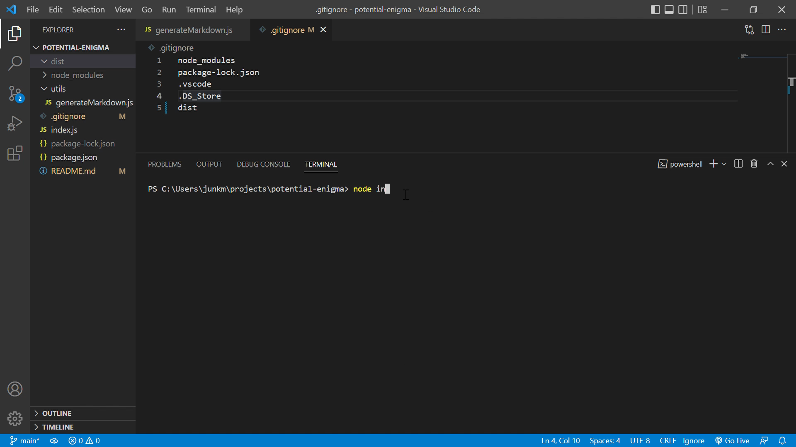

# Professional README Generator

## Description
A command-line application that dynamically generates a professional README.md file from a user's input using the Inquirer package.

## Technologies used:
- JavaScript
- Node.js

## Demo
